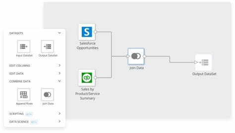

# My Project

## Table of Contents
- [Introduction](#introduction)
- [This Project](#this-project)
- [Persistence](#persistence)
- [Determination](#determination)

## Introduction
This is a description of my project.

## This Project
This project is about Git.

## Persistence
It was hard, but I made it.

## Determination
I will be so good with data engineering.

# My Project

## Table of Contents
- [Introduction](#introduction)
- [This Project](#this-project)
- [Persistence](#persistence)
- [Determination](#determination)

---

## Introduction
This is a description of my project. Here, you can include more details about the purpose and scope of your project.

[Back to Table of Contents](#table-of-contents)

---

## This Project
This project is about Git. It covers various aspects of version control, including how to use Git effectively.

[Back to Table of Contents](#table-of-contents)

---

## Persistence
It was hard, but I made it. In this section, you can describe challenges you faced and how you overcame them.

[Back to Table of Contents](#table-of-contents)

---

## Determination
I will be so good with data engineering. Here, you can share your goals and aspirations in the field of data engineering.

[Back to Table of Contents](#table-of-contents)
